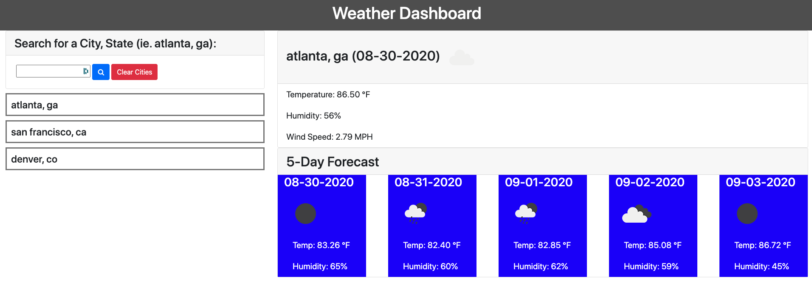

# Weather Dashboard

## Description

This is a weather dashboard.

You can search for a city,state in the US. Since there are multiple cities in the US with the same name you have to add the state.

The cities/states are saved off into local storage and you can click on them to view their current weather and 5-day forecast.

Deployed Application
https://reynolkb.github.io/weather-dashboard/

## Table of Contents

* [Installation](#installation)
* [Usage](#usage)
* [Credits](#credits)
* [License](#license)

## Installation

* Navigate to [https://github.com/reynolkb/weather-dashboard](https://github.com/reynolkb/weather-dashboard). 
* Click the 'code' button and download the zip file.
* Unzip the file on your computer.

## Usage 

Once you've downloaded the code open the zipped folder in an IDE. 

## Credits

[Kyle Reynolds](https://github.com/reynolkb) updated this code to follow accessibility standards.

## License

MIT License

Copyright (c) [2020] [KyleReynolds]

Permission is hereby granted, free of charge, to any person obtaining a copy
of this software and associated documentation files (the "Software"), to deal
in the Software without restriction, including without limitation the rights
to use, copy, modify, merge, publish, distribute, sublicense, and/or sell
copies of the Software, and to permit persons to whom the Software is
furnished to do so, subject to the following conditions:

The above copyright notice and this permission notice shall be included in all
copies or substantial portions of the Software.

THE SOFTWARE IS PROVIDED "AS IS", WITHOUT WARRANTY OF ANY KIND, EXPRESS OR
IMPLIED, INCLUDING BUT NOT LIMITED TO THE WARRANTIES OF MERCHANTABILITY,
FITNESS FOR A PARTICULAR PURPOSE AND NONINFRINGEMENT. IN NO EVENT SHALL THE
AUTHORS OR COPYRIGHT HOLDERS BE LIABLE FOR ANY CLAIM, DAMAGES OR OTHER
LIABILITY, WHETHER IN AN ACTION OF CONTRACT, TORT OR OTHERWISE, ARISING FROM,
OUT OF OR IN CONNECTION WITH THE SOFTWARE OR THE USE OR OTHER DEALINGS IN THE
SOFTWARE.